<p align="center">
  
</p>

 <div align="justify">
Le réseau métier des roboticiens et mécatroniciens du CNRS organise des journées thématiques sur les robots quadrupèdes et humanoïdes afin de favoriser le partage de connaissances et les retours d’expérience autour de ces robots. Cette journée est cofinancée par le réseau 2RM et INRIA. [12 et 13 octobre 2026].
</div>

 ---

 
# TP2 — RL pour la locomotion du robot Unitree Go2

Ce TP est le second des journées thématiques *robotique quadrupède et humanoïde 2026*.

L'objectif pour les participants est de comprendre et tester un modèle de contrôle entraîné par apprentissage par renforcement pour la locomotion du robot Unitree Go2.

## 📑 Sommaire

1. [Architecture](#Architecture)
2. [Installation guide](#Installation)
3. [Partie 1: Entraînement](#Entraînement)
4. [Partie 2: Déploiement ](#Déploiement )

**Ce dépôt fournit un framework Python pour l’entraînement et le déploiement du robot quadrupède Unitree Go2. Il est conçu pour entraîner des politiques par apprentissage par renforcement (Reinforcement Learning) et les déployer dans MuJoCo de la même manière qu’elles le seraient sur le robot réel.**


<table align="center" style="border-collapse:collapse;">
<th style="width:30%; text-align:center;">
  <div style="display:inline-block; width:100px;">Entraînement sur Mjlab</div>
</th>

  <tr>
    <td style="width:30%; text-align:center;">
      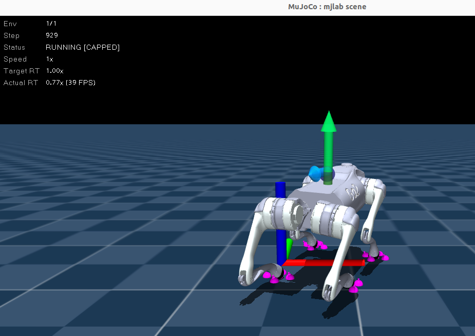
    </td>

  </tr>
</table>

<table align="center" style="border-collapse:collapse;">
<th style="width:30%; text-align:center;">
  <div style="display:inline-block; width:200px;">Déploiement sur Mujoco</div>
</th>

  <tr>
    <td style="width:30%; text-align:center;">
      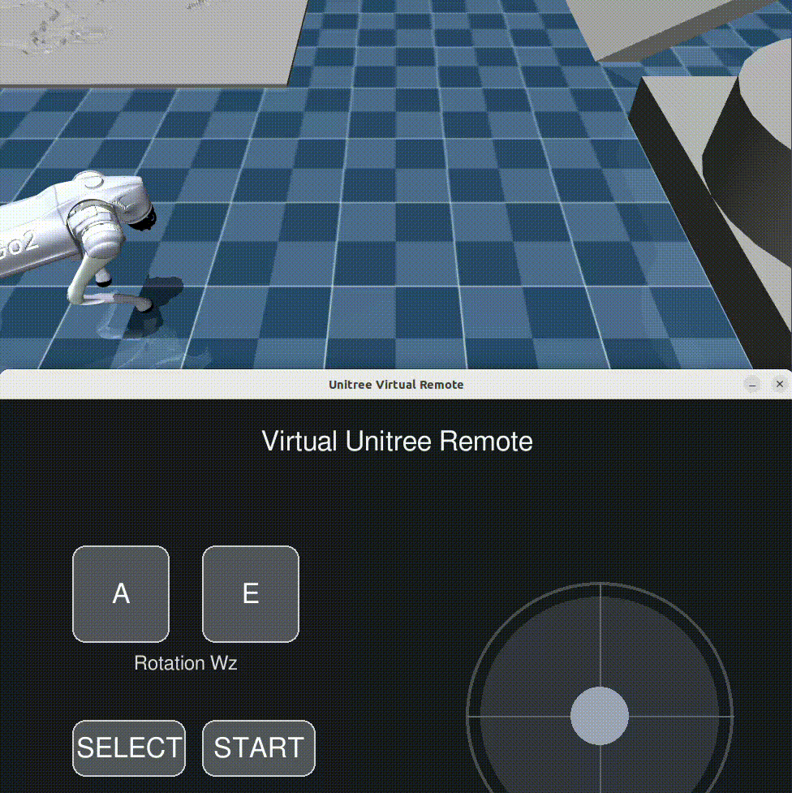
    </td>

  </tr>
</table>

---
<a id="Architecture"></a>
## 📁 Architecture

```
SUMMER-SCHOOL-RL/
  ├── 1.Training/
  │     └── src/
  │          ├── unitree_go2/
  │          │    ├── xmls
  │          │    └── go2_constants.py
  │          │
  │          └── unitree_go2_velocity/
  │               ├── env_cfg.py
  │               ├── rl_cfg.py
  │               └── runner.py
  │     
  ├── 2.Deploy/
  │     ├── Unitree_mujoco/
  │     │    ├── simulate_python
  │     │    ├── terrain_tool
  │     │    └── unitree_robots
  │     │
  │     ├── Deploy_python/
  │     │   ├── common
  │     │   ├── mini_examples
  │     │   ├── policy
  │     │   ├── deploy.py
  │     │   └── deploy_to_fill.py
  │     │
  │     ├── cyclonedds
  │     └── unitree_sdk2_python
  ├── doc/
  ├── docker/
  └── README.md
```

---
<a id="Installation"></a>
# 📝 Installation guide
Pour ce tutoriel, les participants doivent installer l'image Docker déjà construite. Veuillez suivre ce guide. Il est conçu pour que vous n’ayez normalement qu’à copier-coller les commandes dans le terminal. 

**🐳 Docker** : [📘 Installation avec Docker](doc/Docker.md)

Une fois le Docker téléchargé, vous pouvez essayer de le lancer.

---
<a id="Entraînement"></a>
# 🏋️ Partie 1: Entraînement 

Dans le conteneur, allez dans l’espace de travail MJLab :
```bash
cd /opt/mjlab
```

Vous devriez voir :
<p align="center">
  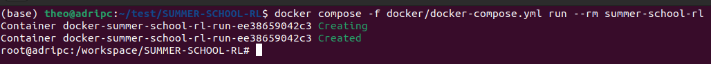
</p>

---

Lancez l’environnement Go2 avec une politique aléatoire :

```bash
uv run play Mjlab-Velocity-Flat-Unitree-Go2 --agent random
```

Vous devriez voir :
<p align="center">
  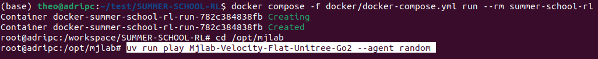
  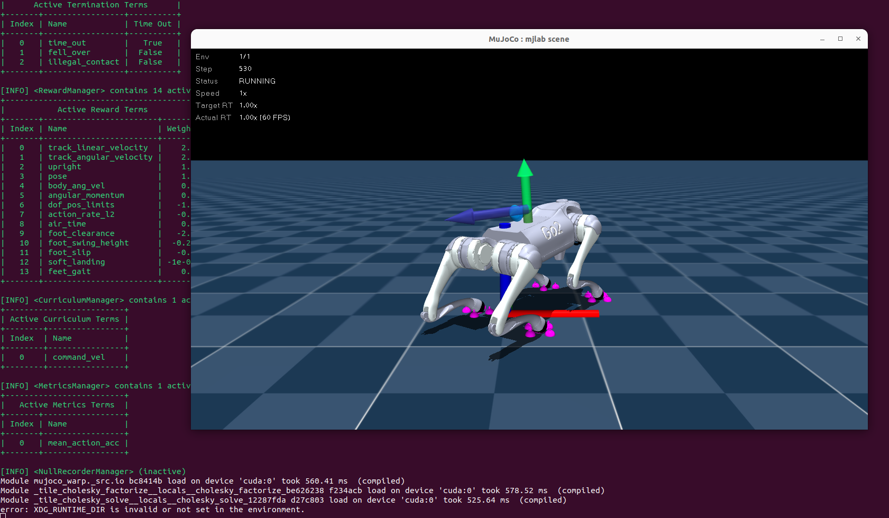
</p>

---

Vous pouvez ensuite essayer de lancer le script d’entraînement, qui est incomplet (sections à dé-commenter pendant le tutoriel).

Lancez l’entraînement :

```bash
uv run train Mjlab-Velocity-Flat-Unitree-Go2 --env.scene.num-envs 1024
```

Entrez le choix 3 :
<p align="center">
  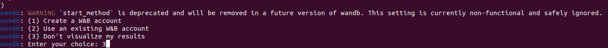
</p>

Vous devriez voir les logs :
<p align="center">
  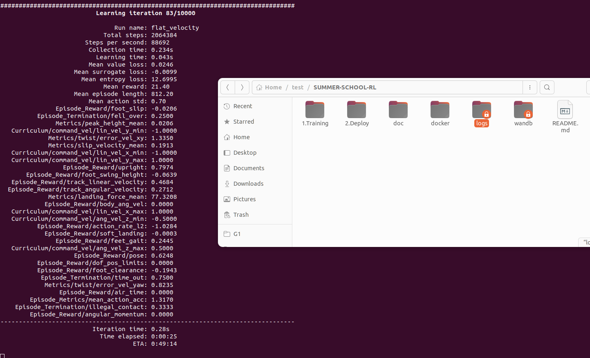
</p>

---
<a id="Déploiement"></a>
# 🤖 Partie 2: Déploiement 
## 1️⃣ Lancer le simulateur MuJoCo

Dans le conteneur :

```bash
cd /workspace/SUMMER-SCHOOL-RL/2.Deploy

python Unitree_mujoco/simulate_python/unitree_mujoco.py
```
 <p align="center">
  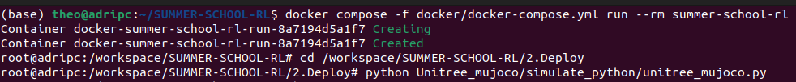
  <br>
 </p>
 
Vous devriez voir :

 <p align="center">
  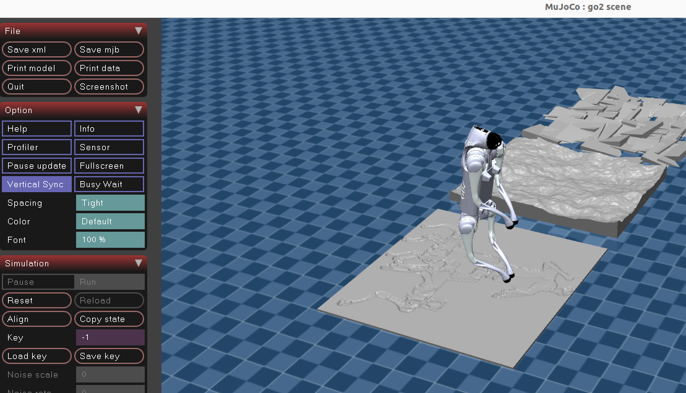
  <br>
 </p>
 <p align="center">
Le robot est maintenu par un élastique invisible :
  
Appuyez sur <kbd>9</kbd> pour activer ou désactiver l’élastique. Lorsqu’il est activé, vous pouvez modifier la force de l’élastique : appuyez plusieurs fois sur <kbd>7</kbd> pour lever le robot et plusieurs fois sur <kbd>8</kbd> pour l’abaisser.
</p>

Appuyez sur le bouton <kbd>RESET</kbd> dans le menu à gauche pour réinitialiser la position du robot (assurez-vous que l’élastique est désactivé en appuyant sur <kbd>9</kbd> sur votre clavier).

Consultez le guide des commandes de MuJoCo :
 <p align="center">
  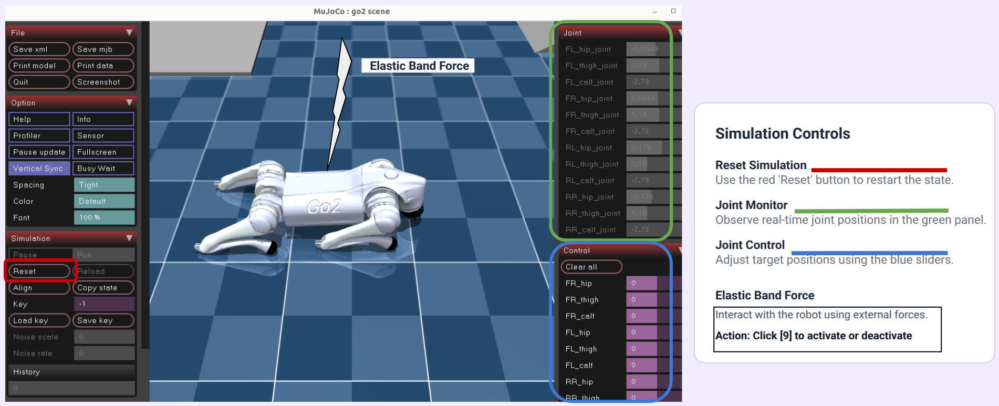
  <br>
 </p>
 
 # Important 
 Ici, MuJoCo fonctionne exactement comme en conditions réelles : vous ne devez pas fermer la fenêtre MuJoCo. Cela fonctionne comme si vous aviez le robot à côté de vous. Réinitialisez simplement le robot chaque fois que vous lancez le fichier `deploy.py` pendant le workshop.
 
---

## 2️⃣ Ouvrir un second terminal dans le même conteneur

Sur la machine hôte :

```bash
docker ps
```

Copiez le nom du conteneur, puis exécutez :

```bash
docker exec -it CONTAINER_NAME bash
```

Exemple :

```bash
docker exec -it docker-summer-school-rl-run-8a7194d5a1f7 bash
```
 <p align="center">
  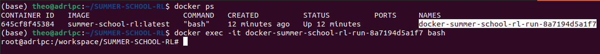
  <br>
 </p>
 
---

## 3️⃣ Lancer le script de déploiement

Dans le second terminal Docker :

```bash
cd /workspace/SUMMER-SCHOOL-RL/2.Deploy

python Deploy_python/deploy.py
ASSUREZ-VOUS QUE LE ROBOT EST ALLONGÉ ET RÉINITIALISÉ, AVEC L’ÉLASTIQUE DÉSACTIVÉ.
```

Vous devriez voir :
 <p align="center">
  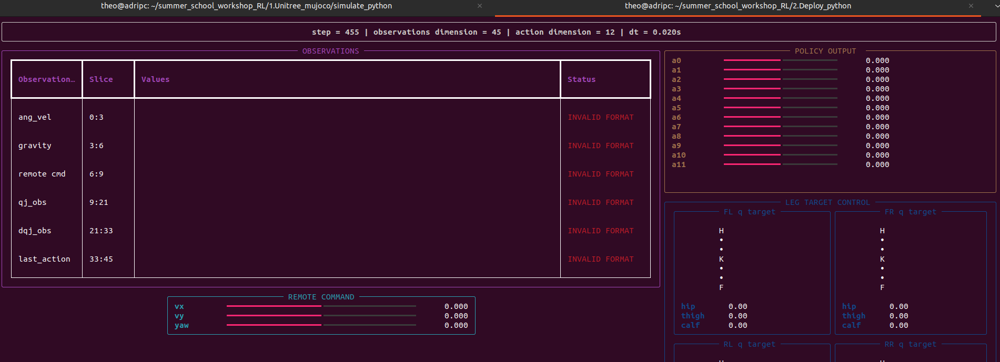
  <br>
 </p>
 
Ou sans le tableau de bord, avec l’option `--debug` :

```bash
python Deploy_python/deploy.py --debug
```

Au début, le fichier de déploiement ne fonctionne pas correctement tant que vous n’avez pas terminé le workshop. Le robot va donc simplement tomber après s’être relevé :

 <p align="center">
  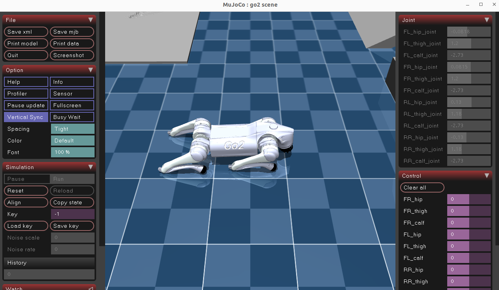
  <br>
 </p>
 
## 4️⃣ Réaliser les tâches du TP

La préparation est maintenant terminée.

Pendant la semaine de la summer school, les étudiants devront réaliser les différentes tâches nécessaires pour entraîner puis déployer une politique de locomotion pour le Go2.

Lorsque vous aurez terminé toutes les tâches, le robot devrait marcher et vous devriez voir :

 <p align="center">
  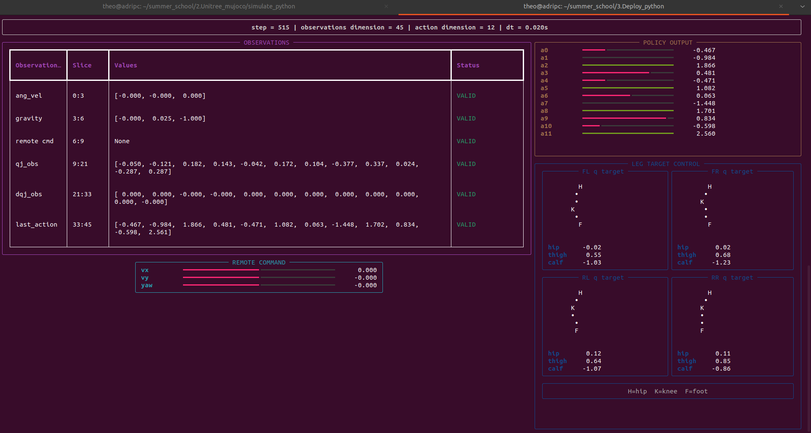
  <br>
 </p>

<table align="center" style="border-collapse:collapse;">
<th style="width:30%; text-align:center;">
  <div style="display:inline-block; width:200px;">Fichier de déploiement complété</div>
</th>

  <tr>
    <td style="width:30%; text-align:center;">
      
    </td>

  </tr>
</table>

---


---
##  Liens

Voici les dépôts que nous avons utilisés pour ce workshop :

| 🔗 Resources | 📍 Link |
|--------------|---------|
|  **Unitree SDK2 Python** | [https://github.com/unitreerobotics/unitree_sdk2_python](https://github.com/unitreerobotics/unitree_sdk2_python) |
|  **unitree_rl_lab** | [https://github.com/unitreerobotics/unitree_rl_lab](https://github.com/unitreerobotics/unitree_rl_lab) |
|  **Mujoco** | [https://github.com/unitreerobotics/unitree_mujoco](https://github.com/unitreerobotics/unitree_mujoco) |
|  **Mjlab** | [https://github.com/mujocolab/mjlab](https://github.com/mujocolab/mjlab) |


---
## 👥 Authors & Contributors

**Author:**  
Théo Bounaceur & Ioannis Loizou (PhD student)  
Laboratory **LORIA** (CNRS / University of Lorraine), Nancy, France  
🧬 Field: Reinforcement Learning · Unitree robots · Unitree SDK2 · IsaacLab · IsaacGym · MuJoCo · ROS2  
📫 Contact: theo.bounaceur@loria.fr & ioannis.loizou@inria.fr

**Supervisors / Advisors:**  
- Adrien Guenard, Ingénieur robotique, Loria 
- Cyril Regan, Ingénieur I.A., Loria
- Serena Ivaldi, Chercheuse en robotique, Loria
  
